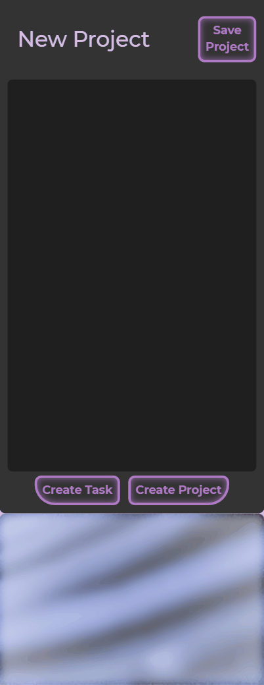

p

  

  <h1 align="center">🛒✅ Todo List</h1>

<h3 align='center'>  
    A Todo List App Designed For Mobile
</h3>

     
    <a href=""><strong>Check Out The App »</strong></a>
     
     
    <a href="">Download this repository</a>
    |
    <a href="">Report A Bug</a>
    |
    <a href="">Fork It</a>
  

## Table of Contents
  - [The Project Brief](https://github.com/Rhelli/Restaurant-Website/tree/feature/readme#-the-project-brief)
  - [Project Specific](https://github.com/Rhelli/Restaurant-Website/tree/feature/readme#-the-nitty-gritty)
  - [Tools & Tech](https://github.com/Rhelli/Restaurant-Website/tree/feature/readme#-tools--technology-used)
  - [Setup & Use](https://github.com/Rhelli/Restaurant-Website/tree/feature/readme#%EF%B8%8F-setup--use)
  - [Showcase](https://github.com/Rhelli/Restaurant-Website/tree/feature/readme#-showcase)
  - [Contributions, Issues and Forking](https://github.com/Rhelli/Restaurant-Website/tree/feature/readme#-contributions-issues-and-forking)
  - [Creators](https://github.com/Rhelli/Restaurant-Website/tree/feature/readme#%EF%B8%8F-creator)
  - [Show Your Support!](https://github.com/Rhelli/Restaurant-Website/tree/feature/readme#%EF%B8%8F-show-your-support)
  - [Licensing](https://github.com/Rhelli/Restaurant-Website/tree/feature/readme#-licensing)

## 🧬 The Project Brief

This is a project to be included by all students at [Microverse](https://www.microverse.org/) as part of the Javascript module.

In this project, we were given the opportunity to create a todo list app. The project was to be entirely made using javascript - that goes for DOM manipulation as well as creating the HTML! Styles were handled using SCSS and the app was packaged using webpack.

The end goal was to have an application which would allow the user to create multiple lists or 'projects', add multiple tasks to them and be able to include prioritisation identifiers, descriptions and due dates per task created. All tasks and projects should additionally be deletable so the user can start all over again.

## 💡 The Project Specific
Having just finished reading about SOLID principles and the correct way to organise you Javascript code, this project focused on attempting to organise our code in a more professional manner. Similarly, in adopting SOLID principles, we attempted to make our code more coherent and more effective, whilst writing less.

The finished version of the app is written entirely in ES6 Javascript (with SCSS for styling) and uses webpack to assemble and package the app.

## 🔬 Tools & Technology Used
**Languages & Frameworks**
 - Javascript
 - Webpack 4.44
 - SASS/CSS3

**Package Management**
 - NPM

**Linters & Quality Control**
 - [ESlint](https://eslint.org/)
 - [StyleLint](https://stylelint.io/)

### 💾 Setup & Use

#### Setup
For the live site, [head here.]()

1. To inspect and tinker with the code on your system, download this repo either [here]() or from the link at the top of the page

2. Now it's time to ensure you've got Node and NPM installed. If you do, skip this step. Otherwise, head on over to [nodejs's website](https://nodejs.org/en/) to download node with npm.

3. Time to go back to the project! Open your terminal (either in your text editor or otherwise) and 'cd' (i.e. navigate) to the root of this repo.

4. Time to install Webpack! Ensuring you're at this repo's root, enter the following command into your terminal. This will install webpack locally (to this project only):
    
        npm install --save-dev webpack

5. Finally, once webpack has installed successfully, run the following command to install all of the projects dependencies:

        npm install

#### Usage
There are a few commands that you can use interact with the project:
 - `$npm run build` - This will build the project using webpack and bundle everything into the `/dist` folder.
 - `$npm run watch` - This will build and update the project in the `/dist` folder **actively**, meaning changes will update `/dist`. You will, however, have to refresh the browser to see changes.
 - `$npm run start` - This will build and update the project with changes. No browser refresh required.

******

## 🎟️ Showcase

### Creating New Projects

> The user can enter their chosen project name at the top of the page. Don't like the name? Re-select the project name and enter a new one!

### Adding Tasks

> Creating and editing tasks is just as easy as editing project titles. 

### Adding A Description and Date

> The description and date dropdown allows the user to enter more information if they need to remember more.

### Deleting Projects

*******

## 🔱 Contributions, Issues and Forking

Contributions, issues and feature requests are more than welcome! 

If you have any problems running or setting up this project, please submit it as a bug on the [issues page](https://github.com/Rhelli/Restaurant-Website/issues) right away!

If you want to make your own changes, modifications or improvements, go ahead and Fork it!
1. [Fork it](https://github.com/Rhelli/Restaurant-Website/fork)
2. Create your working branch (git checkout -b [choose-a-name])
3. Commit your changes (git commit -am 'what this commit will fix/add/improve')
4. Push to the branch (git push origin [chosen-name])
5. Create a new Pull Request

## 👨🏽‍💻 💂🏽‍♂️ Creators

Alexis Sanchez - [Github](https://github.com/Psiale)

Rory Hellier - [Github](https://github.com/Rhelli)

## 👏🏽 Show Your Support!
Give a ⭐️ if you like this project!

## 📑 Licensing
This project is [MIT](https://github.com/Rhelli/Restaurant-Website/LICENSE.txt) licensed.